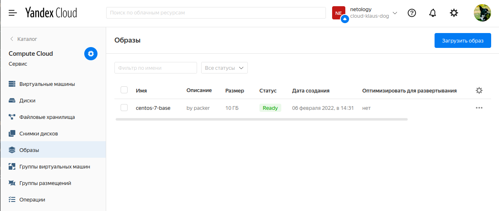
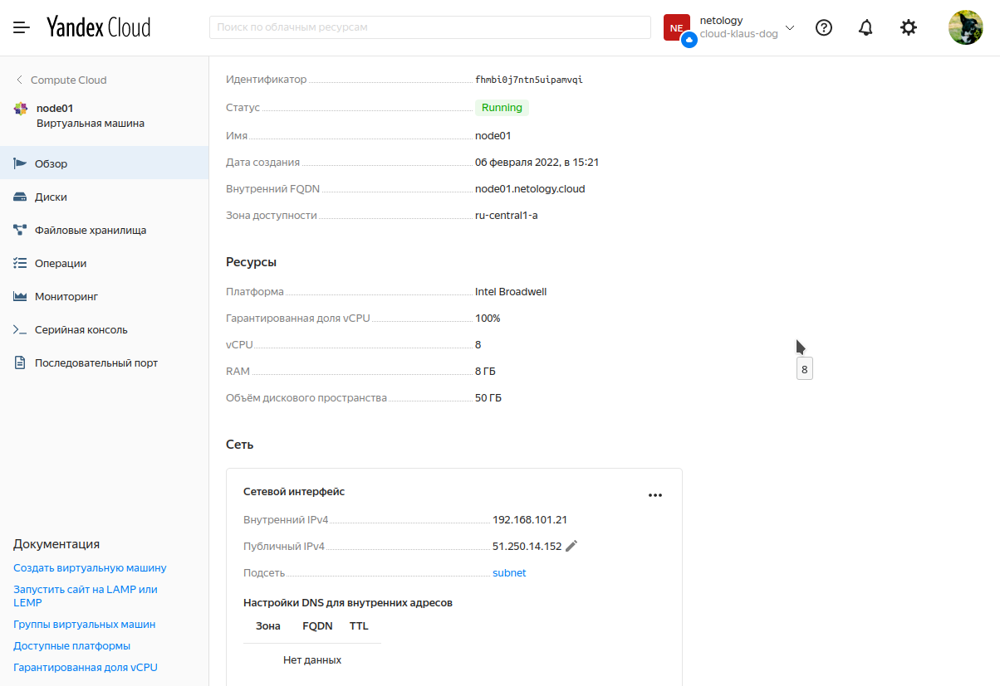
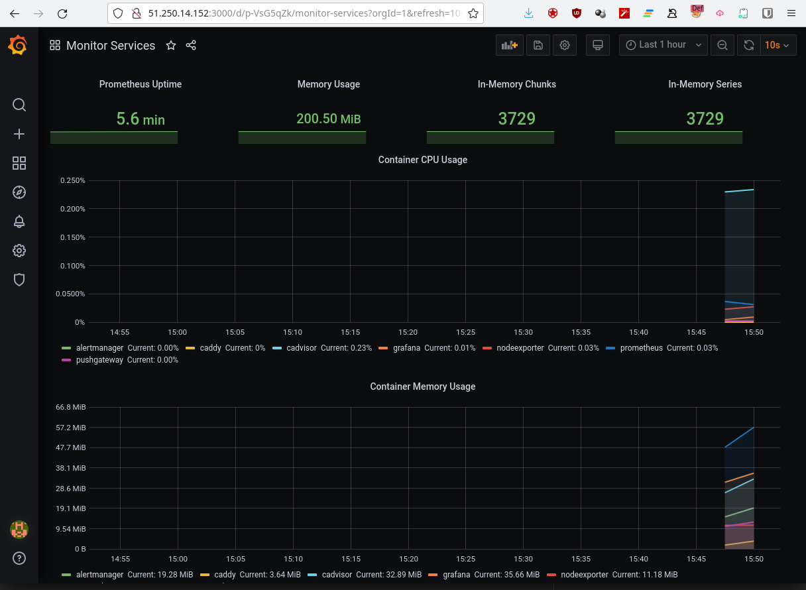

# Домашнее задание к занятию "5.4. Оркестрация группой Docker контейнеров на примере Docker Compose"

## Задача 1

Создать собственный образ операционной системы с помощью Packer.

Было проинициализировано CLI окружение для управления yandex cloud.
В конфигурацию centos-7-base.json добавлены id и токен для моего yandex cloud.
После сборки образа с помощью packer видим получившийся image:
```commandline
yc compute image list
+----------------------+---------------+--------+----------------------+--------+
|          ID          |     NAME      | FAMILY |     PRODUCT IDS      | STATUS |
+----------------------+---------------+--------+----------------------+--------+
| fd8rtipj0fi647mg06nh | centos-7-base | centos | f2eacrudv331nbat9ehb | READY  |
+----------------------+---------------+--------+----------------------+--------+
```
Так же образ можно увидеть на скриншоте:

<p align="center">
  
</p>


## Задача 2

Создать вашу первую виртуальную машину в Яндекс.Облаке.

После создания сервисного пользователя через web интерфейс генерируем key.json:
```commandline
yc iam key create --service-account-name robot --output key.json
```

Запускаем ```terraform apply -auto-approve``` и после завершения работы команды проверяем создавшуюся VM:

```commandline
yc compute instance list
+----------------------+--------+---------------+---------+---------------+----------------+
|          ID          |  NAME  |    ZONE ID    | STATUS  |  EXTERNAL IP  |  INTERNAL IP   |
+----------------------+--------+---------------+---------+---------------+----------------+
| fhmbi0j7ntn5uipamvqi | node01 | ru-central1-a | RUNNING | 51.250.14.152 | 192.168.101.21 |
+----------------------+--------+---------------+---------+---------------+----------------+

```

Скриншот машины в web интерфейсе:

<p align="center">
  
</p>

## Задача 3

Создать ваш первый готовый к боевой эксплуатации компонент мониторинга, состоящий из стека микросервисов.

В inventory файл был добавлен EXTERNAL IP адрес полученный в задании 2 и запущен ansible плуйбук provision.yml.

В итоге получаем работающую Grafana на 3000 порту:

<p align="center">
  
</p>
 