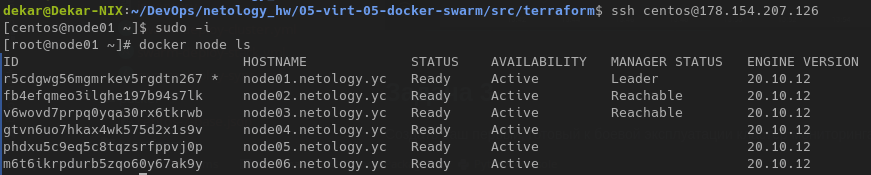
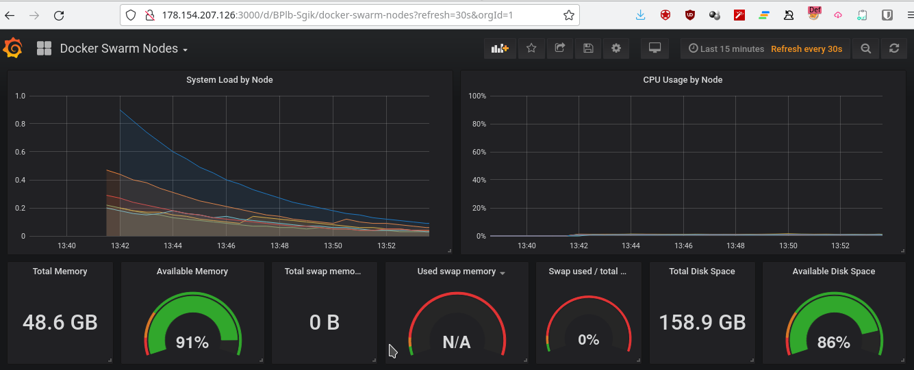
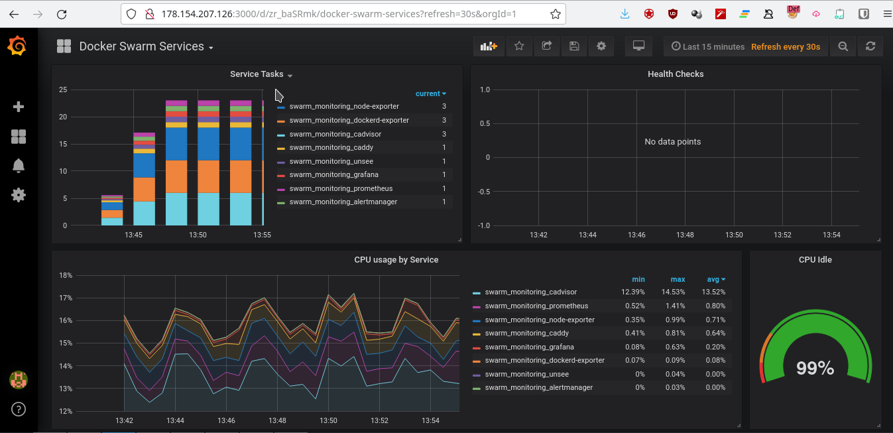
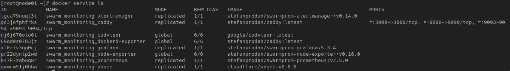

# Домашнее задание к занятию "5.5. Оркестрация кластером Docker контейнеров на примере Docker Swarm"

## Задача 1

Дайте письменные ответы на следующие вопросы:

- В чём отличие режимов работы сервисов в Docker Swarm кластере: replication и global?
  - в режиме replication сервис можно масштабировать на необходимое количество нод кластера.
  - в режиме global - реплика сервиса существует на всех нодах и не масштабируется в сторону уменьшения.
- Какой алгоритм выбора лидера используется в Docker Swarm кластере?
  - Для выбора лидера используется алгоритм распределённого консенсуса Raft.
    Raft делит время на отрезки произвольной длины, называемые сроками.
    Каждый срок имеет монотонно возрастающий номер. Срок начинается с выборов лидера,
    когда один или несколько серверов становятся кандидатами.
    В случае, если кандидат получает большинство голосов, он становится лидером до конца данного срока.
    Если же голоса разделились, и ни один из кандидатов не может получить большинство голосов, срабатывает таймаут и текущий срок заканчивается.
    После этого начинается новый срок с новыми кандидатами и выборами. Такая ситуация называется split vote.
    Номер срока служит в качестве логического timestamp в кластере Raft.
    Он помогает серверам определять, какая информация более актуальна на текущий момент.
    Каждый сервер должен отслеживать номер своего текущего срока.
    Сервер включает номер своего срока в каждое отправляемое сообщение.
    Если сервер получает сообщение с меньшим номером срока, чем его собственный, то он игнорирует это сообщение.
    Если сервер получает сообщение с большим номером срока, чем его собственный, то он обновляет свой номер срока, чтобы тот соответствовал полученному.
    Если кандидат или лидер получает сообщение с большим номером срока, чем его собственный, то он понимает, что другие сервера уже инициировали новый срок, а его срок более неактуален.
    Поэтому он переходит из текущего состояния в состояние follower вдобавок к обновлению своего номера.
- Что такое Overlay Network?
  - Overlay-сети используются в кластере для взаимодействия контейнеров (сервисов) друг с другом.
    Overlay сеть даёт всему кластеру единое пространство DNS имён.
    Можем посмотреть на примере вывода команды docker network ls:
    ```commandline
    [root@node01 ~]# docker network ls
    NETWORK ID     NAME                   DRIVER    SCOPE
    8b50198df2c8   bridge                 bridge    local
    91734496b4f6   docker_gwbridge        bridge    local
    facbf4e6fb6c   host                   host      local
    1quhocrs887c   ingress                overlay   swarm
    0d66b36e7c42   none                   null      local
    ea9y7r78opwq   swarm_monitoring_net   overlay   swarm
    ```
    Из вывода видно, что имеется сеть типа overlay с именем ingress, которая используется для распределения нагрузки,
    и сеть типа bridge с названием docker_gwbridge - используется для коммуникации самих Docker демонов.

## Задача 2

Создать ваш первый Docker Swarm кластер в Яндекс.Облаке

Для получения зачета, вам необходимо предоставить скриншот из терминала (консоли), с выводом команды:
```
docker node ls
```
Подключаемся к первой ноде по ssh и запускаем docker node ls:
```commandline
sh centos@178.154.207.126
[centos@node01 ~]$ sudo -i
[root@node01 ~]# docker node ls
ID                            HOSTNAME             STATUS    AVAILABILITY   MANAGER STATUS   ENGINE VERSION
r5cdgwg56mgmrkev5rgdtn267 *   node01.netology.yc   Ready     Active         Leader           20.10.12
fb4efqmeo3ilghe197b94s7lk     node02.netology.yc   Ready     Active         Reachable        20.10.12
v6wovd7prpq0yqa30rx6tkrwb     node03.netology.yc   Ready     Active         Reachable        20.10.12
gtvn6uo7hkax4wk575d2x1s9v     node04.netology.yc   Ready     Active                          20.10.12
phdxu5c9eq5c8tqzsrfppvj0p     node05.netology.yc   Ready     Active                          20.10.12
m6t6ikrpdurb5zqo60y67ak9y     node06.netology.yc   Ready     Active                          20.10.12
```
Скриншоты:
<p align="center">
  
</p>

<p align="center">
  
</p>

<p align="center">
  
</p>

## Задача 3

Создать ваш первый, готовый к боевой эксплуатации кластер мониторинга, состоящий из стека микросервисов.

Для получения зачета, вам необходимо предоставить скриншот из терминала (консоли), с выводом команды:
```
docker service ls
```

Скриншот вывода docker service ls:
<p align="center">
  
</p>

Вывод из терминала с первой ноды (ip 178.154.207.126):
```commandline
[root@node01 ~]# docker stack ls
NAME               SERVICES   ORCHESTRATOR
swarm_monitoring   8          Swarm
[root@node01 ~]# docker service ls
ID             NAME                                MODE         REPLICAS   IMAGE                                          PORTS
tgca79nuqt3t   swarm_monitoring_alertmanager       replicated   1/1        stefanprodan/swarmprom-alertmanager:v0.14.0    
gc3jofphfrks   swarm_monitoring_caddy              replicated   1/1        stefanprodan/caddy:latest                      *:3000->3000/tcp, *:9090->9090/tcp, *:9093-9094->9093-9094/tcp
nj6j670olo6l   swarm_monitoring_cadvisor           global       6/6        google/cadvisor:latest                         
69qd0s0783jz   swarm_monitoring_dockerd-exporter   global       6/6        stefanprodan/caddy:latest                      
xl0z7v3qg0cj   swarm_monitoring_grafana            replicated   1/1        stefanprodan/swarmprom-grafana:5.3.4           
pr22dynlp2wd   swarm_monitoring_node-exporter      global       6/6        stefanprodan/swarmprom-node-exporter:v0.16.0   
k47k7zqbuq8r   swarm_monitoring_prometheus         replicated   1/1        stefanprodan/swarmprom-prometheus:v2.5.0       
qwmcm51j0hba   swarm_monitoring_unsee              replicated   1/1        cloudflare/unsee:v0.8.0
```


## Задача 4 (*)

Выполнить на лидере Docker Swarm кластера команду (указанную ниже) и дать письменное описание её функционала, что она делает и зачем она нужна:
```
# см.документацию: https://docs.docker.com/engine/swarm/swarm_manager_locking/
docker swarm update --autolock=true
```
Команда docker swarm update --autolock=true позволяет стать владельцем ключей шифрования существующего кластера Swarm,
как используемого для связи между узлами Swarm, так и, используемого для шифрования и расшифровки журналов Raft на диске.
После выполнения команды необходима ручная разблокировка менеджмент нод после их рестарта.
Выполним указанную выше команду и перезапустим докер сервис:
```commandline
[root@node01 ~]# docker swarm update --autolock=true
Swarm updated.
To unlock a swarm manager after it restarts, run the `docker swarm unlock`
command and provide the following key:

    SWMKEY-1-G4hAXsnOZ4lyNTKNwNq7jqpWQJY9sPXOKpppl7EmPn8
             
Please remember to store this key in a password manager, since without it you
will not be able to restart the manager.
[root@node06 ~]# systemctl restart docker
```

При этом, подключившись к другой менеджмент ноде видим такую картину:
```commandline
[root@node02 ~]# docker node ls
ID                            HOSTNAME             STATUS    AVAILABILITY   MANAGER STATUS   ENGINE VERSION
r5cdgwg56mgmrkev5rgdtn267     node01.netology.yc   Down      Active         Unreachable      20.10.12
fb4efqmeo3ilghe197b94s7lk *   node02.netology.yc   Ready     Active         Reachable        20.10.12
v6wovd7prpq0yqa30rx6tkrwb     node03.netology.yc   Ready     Active         Leader           20.10.12
gtvn6uo7hkax4wk575d2x1s9v     node04.netology.yc   Ready     Active                          20.10.12
phdxu5c9eq5c8tqzsrfppvj0p     node05.netology.yc   Ready     Active                          20.10.12
m6t6ikrpdurb5zqo60y67ak9y     node06.netology.yc   Ready     Active                          20.10.12
```

Попробуем выполнить docker node ls на первой ноде:
```commandline
[root@node01 ~]# docker node ls
Error response from daemon: Swarm is encrypted and needs to be unlocked before it can be used. Please use "docker swarm unlock" to unlock it.
```

Видим, что прежде чем использовать ноду необходимо разлочить её:
```commandline
[root@node01 ~]# docker swarm unlock
Please enter unlock key: 
[root@node01 ~]# docker node ls
ID                            HOSTNAME             STATUS    AVAILABILITY   MANAGER STATUS   ENGINE VERSION
r5cdgwg56mgmrkev5rgdtn267 *   node01.netology.yc   Ready     Active         Reachable        20.10.12
fb4efqmeo3ilghe197b94s7lk     node02.netology.yc   Ready     Active         Reachable        20.10.12
v6wovd7prpq0yqa30rx6tkrwb     node03.netology.yc   Ready     Active         Leader           20.10.12
gtvn6uo7hkax4wk575d2x1s9v     node04.netology.yc   Ready     Active                          20.10.12
phdxu5c9eq5c8tqzsrfppvj0p     node05.netology.yc   Ready     Active                          20.10.12
m6t6ikrpdurb5zqo60y67ak9y     node06.netology.yc   Ready     Active                          20.10.12
```

Ключ для разблокирования залоченной менеджмент ноды можно так же получить на любой рабочей менеджмент ноде командой:
```commandline
[root@node02 ~]# docker swarm unlock-key
To unlock a swarm manager after it restarts, run the `docker swarm unlock`
command and provide the following key:

    SWMKEY-1-G4hAXsnOZ4lyNTKNwNq7jqpWQJY9sPXOKpppl7EmPn8

Please remember to store this key in a password manager, since without it you
will not be able to restart the manager.
```

Так же при необходимости можно изменить этот ключ командой:
```commandline
[root@node02 ~]# docker swarm unlock-key --rotate
Successfully rotated manager unlock key.

To unlock a swarm manager after it restarts, run the `docker swarm unlock`
command and provide the following key:

    SWMKEY-1-RL1MJ3U2IzGq5po3rXgSMJKlu7aHh6Lcd79akpveBPM

Please remember to store this key in a password manager, since without it you
will not be able to restart the manager.
```

Если в момент обновления ключа какая-нибудь нода была недоступна и не имеется доступа к предыдущему ключу шифрования,
то необходимо её принудительно вывести из кластера и ввести обратно как новую менеджмент ноду.